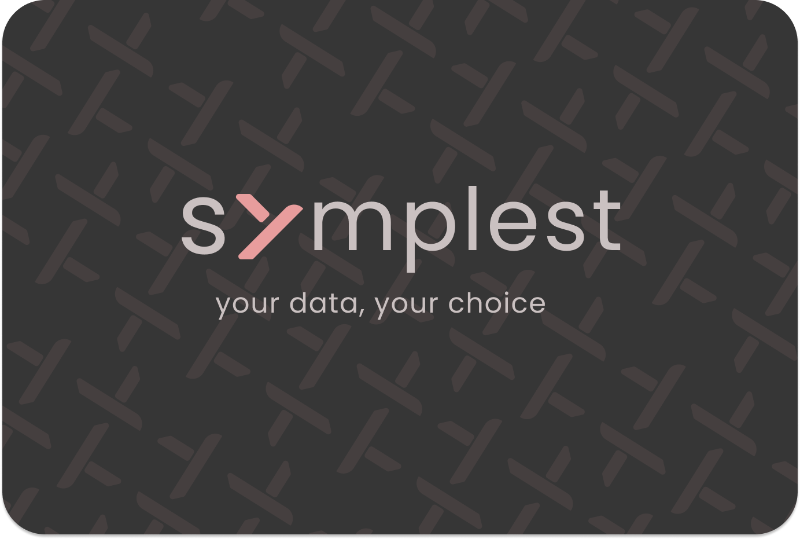
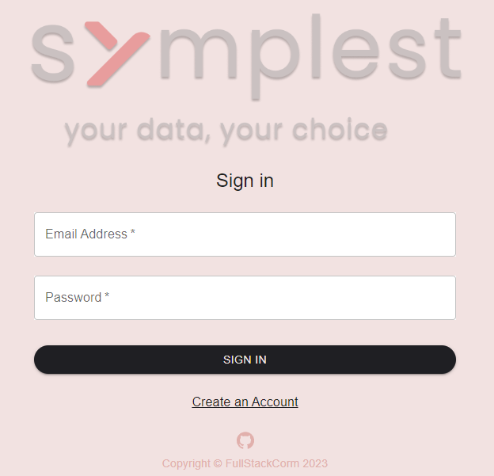
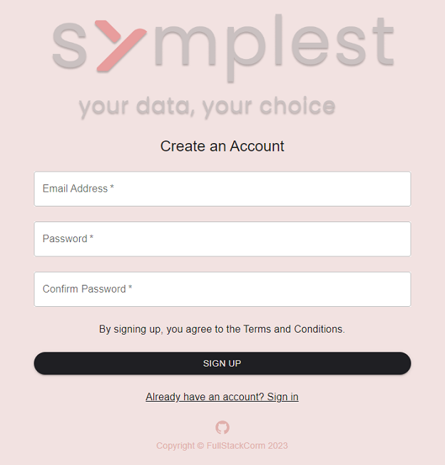
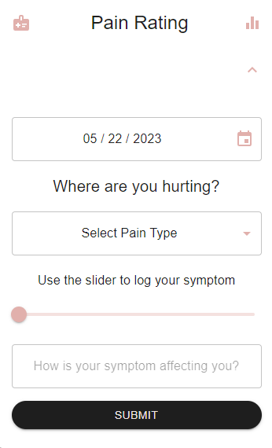
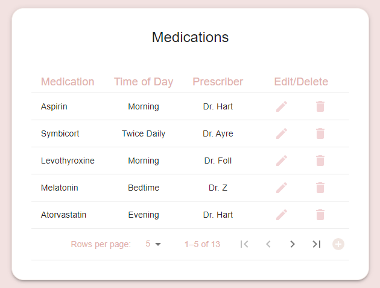

<!-- Improved compatibility of back to top link: See: https://github.com/othneildrew/Best-README-Template/pull/73 -->
<a name="readme-top"></a>
<!--
*** Thanks for checking out the Best-README-Template. If you have a suggestion
*** that would make this better, please fork the repo and create a pull request
*** or simply open an issue with the tag "enhancement".
*** Don't forget to give the project a star!
*** Thanks again! Now go create something AMAZING! :D
-->


<!-- PROJECT SHIELDS -->
<!--
*** I'm using markdown "reference style" links for readability.
*** Reference links are enclosed in brackets [ ] instead of parentheses ( ).
*** See the bottom of this document for the declaration of the reference variables
*** for contributors-url, forks-url, etc. This is an optional, concise syntax you may use.
*** https://www.markdownguide.org/basic-syntax/#reference-style-links
-->


<!-- PROJECT LOGO -->
<br />
<div align="center">
  <a href="https://github.com/FullStackCorm/Symplest">
    
  </a>

  <p align="center">
    <a href="https://github.com/FullStackCorm/Symplest"><strong>Explore the docs »</strong></a>
    <br />
    <br />
    <a href="https://github.com/FullStackCorm/Symplest">View Demo</a>
    ·
    <a href="https://github.com/FullStackCorm/Symplest/issues">Report Bug</a>
    ·
    <a href="https://github.com/FullStackCorm/Symplest/issues">Request Feature</a>
  </p>
</div>


<!-- TABLE OF CONTENTS -->
<details>
  <summary>Table of Contents</summary>
  <ol>
    <li>
      <a href="#about-the-project">About Symplest</a>
      <ul>
        <li><a href="#screenshots">Screenshots</a></li>
        <li><a href="#built-with">Built With</a></li>
      </ul>
    </li>
    <li>
      <a href="#getting-started">Getting Started</a>
      <ul>
        <li><a href="#prerequisites">Prerequisites</a></li>
        <li><a href="#installation">Installation</a></li>
      </ul>
    </li>
    <li><a href="#usage">Usage</a></li>
    <li><a href="#roadmap">Roadmap</a></li>
    <li><a href="#contributing">Contributing</a></li>
    <li><a href="#license">License</a></li>
    <li><a href="#contact">Contact</a></li>
    <!-- <li><a href="#acknowledgments">Acknowledgments</a></li> -->
  </ol>
</details>


<!-- ABOUT SYMPLEST -->
## About Symplest

<div align="center">
  
</div>


Symplest is a health management app that allows users to log their medications, symptom tracking information, and notes related to their health. There are plenty of health apps available, so why did I create another one? 

Here's why:
* 9 out of 10 health apps harvest and sell user data. I believe your private health information should be **your own.**
* The FTC's Health Breach Notification Rule was not enforced for 13 years, beginning in 2009. The FTC only recently resumed enforcement of this rule on February 1, 2023.
* It is especially important for women to retain whatever privacy they can in a post-Roe v. Wade world.

This app has been in development since late 2022 and will be ready for release in June 2023. After its release, I will continue developing features that will allow users to generate reports for their prescribers, an appointment schedule, and create customized symptom tracking parameters. You may also suggest changes by forking this repo and creating a pull request or opening an issue.


## Screenshots

### Login Page
<div align="center">
  
</div>

### Registration Page
<div align="center">
  
</div>

### Symptom Logging
<div align="center">
  
</div>

### Medication Management
<div align="center">
  
</div>

### Built With

 [![MaterialUI][MaterialUI]][MaterialUI-url] [![React][React.js]][React-url] [![Node.js][Node.js]][Node-url] [![Express.js][Express.js]][Express-url] [![MongoDB][MongoDB]][MongoDB-url]


<p align="right">(<a href="#readme-top">back to top</a>)</p>

<!-- GETTING STARTED -->
## Getting Started

To get a local copy up and running follow these steps:

### Prerequisites

* npm
  ```sh
  npm install npm@latest -g
  ```

### Installation

1. Get a free Connection String from MongoDB at [https://www.mongodb.com/](https://www.mongodb.com/)
2. Clone the repo
   ```sh
   git clone https://github.com/FullStackCorm/Symplest
   ```
3. Install NPM packages

    Backend:
   ```sh
   npm install
   ```
   
   Frontend:
   ```sh
   cd client
   npm install
   ```
   
   Run Frontend and Backend simultaneously:
   ```sh
   npm install concurrently
   npm run dev
   ```

<p align="right">(<a href="#readme-top">back to top</a>)</p>


<!-- USAGE EXAMPLES -->
## Usage

Enter the following environment variables in a `.env` file located in the config folder:
   ```js
   DB_STRING = mongodb+srv://db-connection-string
   JWT_SECRET = 
   REFRESH_TOKEN_SECRET =
   REFRESH_TOKEN_EXPIRY = 60 * 60 * 24 * 30
   SESSION_EXPIRY = 60 * 15
   REACT_APP_API_ENDPOINT= http://localhost:5000/
   NODE_ENV = development
   PORT = 5000
   ```


<!-- ROADMAP -->
## Roadmap

- [ ] Add Cycle Tracking
- [ ] Add Symptom Report Exports
- [ ] Add Custom Symptom Tracking Categories
- [ ] Add Appointment Scheduler

See the [open issues](https://github.com/othneildrew/Best-README-Template/issues) for a full list of proposed features (and known issues).


<!-- CONTRIBUTING -->
## Contributing

Contributions are what make the open source community such an amazing place to learn, inspire, and create. Any contributions you make are **greatly appreciated**.

If you have a suggestion that would make this better, please fork the repo and create a pull request. You can also simply open an issue with the tag "enhancement".
Don't forget to give the project a star! Thanks again!

1. Fork the Project
2. Create your Feature Branch (`git checkout -b feature/NewFeature`)
3. Commit your Changes (`git commit -m 'Add New Feature'`)
4. Push to the Branch (`git push origin feature/NewFeature`)
5. Open a Pull Request


<!-- LICENSE -->
## License

Distributed under the MIT License. See `LICENSE.txt` for more information.


<!-- CONTACT -->
## Contact

Corinne - [@FullStackCorm](https://twitter.com/FullStackCorm) - corinne.m.dev@gmail.com

Project Link: [https://github.com/FullStackCorm/Symplest](https://github.com/FullStackCorm/Symplest)


<!-- ACKNOWLEDGMENTS -->
<!-- ## Acknowledgments

Use this space to list resources you find helpful and would like to give credit to. I've included a few of my favorites to kick things off!

* [Choose an Open Source License](https://choosealicense.com)
* [GitHub Emoji Cheat Sheet](https://www.webpagefx.com/tools/emoji-cheat-sheet)
* [Malven's Flexbox Cheatsheet](https://flexbox.malven.co/)
* [Malven's Grid Cheatsheet](https://grid.malven.co/)
* [Img Shields](https://shields.io)
* [GitHub Pages](https://pages.github.com)
* [Font Awesome](https://fontawesome.com)
* [React Icons](https://react-icons.github.io/react-icons/search)
-->

<p align="right">(<a href="#readme-top">back to top</a>)</p>


<!-- MARKDOWN LINKS & IMAGES -->
<!-- https://www.markdownguide.org/basic-syntax/#reference-style-links -->
[contributors-shield]: https://img.shields.io/github/contributors/othneildrew/Best-README-Template.svg?style=for-the-badge
[contributors-url]: https://github.com/othneildrew/Best-README-Template/graphs/contributors
[forks-shield]: https://img.shields.io/github/forks/othneildrew/Best-README-Template.svg?style=for-the-badge
[forks-url]: https://github.com/othneildrew/Best-README-Template/network/members
[stars-shield]: https://img.shields.io/github/stars/othneildrew/Best-README-Template.svg?style=for-the-badge
[stars-url]: https://github.com/othneildrew/Best-README-Template/stargazers
[issues-shield]: https://img.shields.io/github/issues/othneildrew/Best-README-Template.svg?style=for-the-badge
[issues-url]: https://github.com/othneildrew/Best-README-Template/issues
[license-shield]: https://img.shields.io/github/license/othneildrew/Best-README-Template.svg?style=for-the-badge
[license-url]: https://github.com/othneildrew/Best-README-Template/blob/master/LICENSE.txt
[linkedin-shield]: https://img.shields.io/badge/-LinkedIn-black.svg?style=for-the-badge&logo=linkedin&colorB=555
[linkedin-url]: https://www.linkedin.com/in/corinne-manon-michael/
[product-screenshot]: images/screenshot.png
[React.js]: https://img.shields.io/badge/React-20232A?style=for-the-badge&logo=react&logoColor=61DAFB
[React-url]: https://reactjs.org/
[Bootstrap.com]: https://img.shields.io/badge/Bootstrap-563D7C?style=for-the-badge&logo=bootstrap&logoColor=white
[Bootstrap-url]: https://getbootstrap.com
[JQuery.com]: https://img.shields.io/badge/jQuery-0769AD?style=for-the-badge&logo=jquery&logoColor=white
[JQuery-url]: https://jquery.com

[MongoDB]: https://img.shields.io/badge/MongoDB-%234ea94b.svg?style=for-the-badge&logo=mongodb&logoColor=white
[MongoDB-url]: https://www.mongodb.com/
[MaterialUI]: https://img.shields.io/badge/Material%20UI-006cda.svg?style=for-the-badge&logo=mui&logoColor=white
[MaterialUI-url]: https://mui.com/
[Node.js]: https://img.shields.io/badge/node.js-6DA55F?style=for-the-badge&logo=node.js&logoColor=white
[Node-url]: https://nodejs.org/en
[Express.js]: https://img.shields.io/badge/express.js-%23404d59.svg?style=for-the-badge&logo=express&logoColor=%2361DAFB
[Express-url]: https://expressjs.com/
